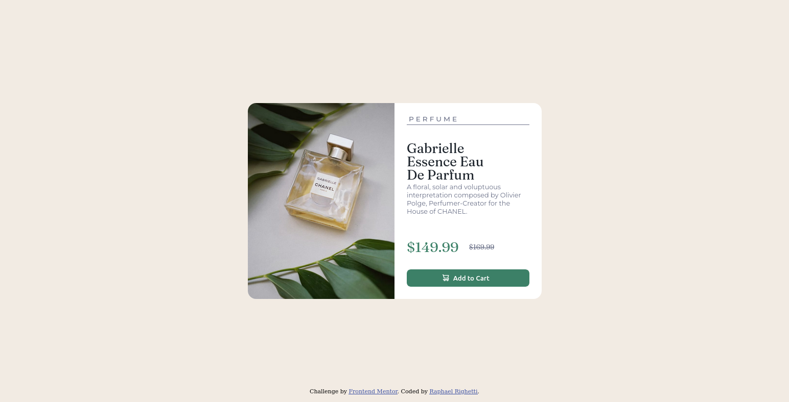

# Frontend Mentor - Product preview card component solution

This is a solution to the [Product preview card component challenge on Frontend Mentor](https://www.frontendmentor.io/challenges/product-preview-card-component-GO7UmttRfa). Frontend Mentor challenges help you improve your coding skills by building realistic projects. 

## Table of contents

- [Overview](#overview)
  - [The challenge](#the-challenge)
  - [Screenshot](#screenshot)
  - [Links](#links)
- [My process](#my-process)
  - [Built with](#built-with)
  - [Useful resources](#useful-resources)
- [Author](#author)

## Overview

### The challenge

Users should be able to:

- View the optimal layout depending on their device's screen size
- See hover and focus states for interactive elements

### Screenshot

### Links

- Solution URL: [Add solution URL here](https://www.frontendmentor.io/challenges/product-preview-card-component-GO7UmttRfa/hub/product-preview-card-component-jK-XcbhC_H)
- Live Site URL: [Add live site URL here](https://raphaelrighetti.github.io/product-preview-card/)

## My process

### Built with

- HTML5
- CSS
- Flexbox
- CSS Grid
- Mobile-first workflow

## Author

- Website - [Raphael Righetti](https://www.raphaelrighetti.github.io)
- Frontend Mentor - [@raphaelrighetti](https://www.frontendmentor.io/profile/raphaelrighetti)